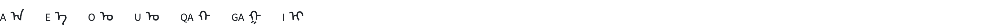
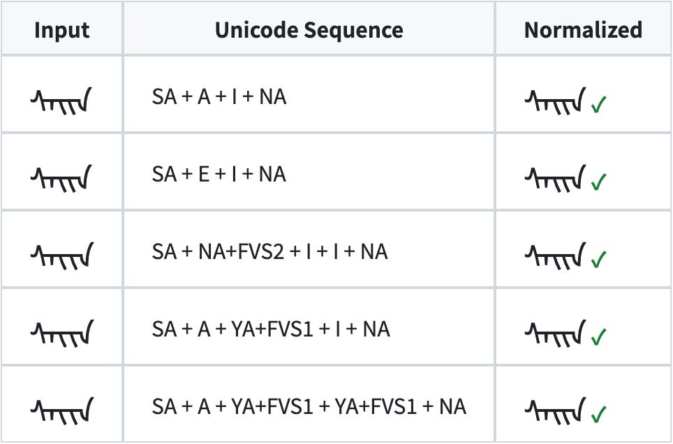

# mongol-norm

[English](#english) | [中文](#中文)

---

<a id="english"></a>
## English

### ⚠️ Status: Experimental

**This project was generated with [Claude Code](https://claude.ai/code) (AI-assisted coding).** The shaping logic is based on UTN #57 v4 and the `mongfontbuilder` data, but **the normalization output has not been independently validated** against a ground-truth corpus or reference implementation. There may be edge cases, incorrect canonical forms, or missed equivalences — especially for:

- Words with ambiguous vowel harmony (no unambiguous o/u/oe/ue vowel)
- Rare FVS combinations
- MVS particle forms
- Todo / Sibe / Manchu locales (normalization not implemented)

**Contributions of test data and bug reports are very welcome** — see [Help Wanted](#help-wanted-test-data) below.

---

### Why This Project Exists

Traditional Mongolian script in Unicode has a fundamental problem: **the same visible word can be encoded in multiple different Unicode sequences**. This happens because:

1. **Letters share glyphs** — A and E look identical in medial and final positions; O and U share forms; QA and GA share forms depending on vowel harmony.
2. **Multiple encoding paths** — The same tooth glyph (I) can be encoded as I, YA+FVS1, or even two separate I characters.


3. **Redundant FVS usage** — Free Variation Selectors (FVS1–FVS4) can create equivalent sequences that render identically.

This means:
- **Search fails**: Searching for "sain" (one encoding) won't find the same word in another encoding, even though they look identical.
- **Deduplication breaks**: The same word has multiple Unicode representations.
- **Indexing is unreliable**: Different encodings of the same word produce different keys.

### What This Project Does

This is a **shaping-aware normalizer** for Traditional Mongolian. It:

1. **Shapes** the input using the full UTN #57 v4 shaping process (5-step conditional mapping)
2. **Compares** glyph sequences to detect identical visual forms
3. **Normalizes** to a canonical, human-readable, bare Unicode encoding

**Example**: All five of these encode the word "sain" (good) and look identical:



### How It Works

The normalizer implements a **lightweight Mongolian shaping engine** — equivalent to what HarfBuzz does with a font file, but using only the rule data from [UTN #57 v4](https://www.unicode.org/notes/tn57/tn57-4.html) and the [mongfontbuilder](https://github.com/Kushim-Jiang/mongfontbuilder) project. No font files needed.

#### Shaping Pipeline (UTN #57 v4 Mongolian-Specific Phase)

1. **Chachlag** — Suffix forms for A/E after MVS (Mongolian Vowel Separator)
2. **Syllabic** — Consonant/vowel context: onset, devsger, marked, masculine/feminine harmony, dotless
3. **Particle** — MVS particle dictionary lookup for specific suffix words
4. **Devsger** — I after a vowel (vowel_devsger) gets double-tooth form: `I → I+I`
5. **Post-bowed** — Vowel forms change after bowed consonants (G, B, K, P, F)

#### Normalization Strategy

After shaping, the normalizer selects the canonical letter for each position:

- **Vowel harmony** (a/e, h/g pairs): Detected from unambiguous vowels (o/u = masculine, oe/ue/ee = feminine) or from the shaping condition of h/g letters.
- **Boundary preservation**: Letters at word-initial and word-final positions preserve their original identity (e.g., NA at final = consonant N, not vowel A).
- **Redundancy removal**: YA+FVS1 producing a tooth → merged with adjacent I tokens. NA+FVS2 producing vowel-A shape → replaced by A.
- **Bare encoding**: Output uses bare Unicode without FVS, since the shaping engine automatically selects the correct variant from context.

### Installation

```bash
git clone https://github.com/Satsrag/mongol-norm.git
cd mongol-norm
pip install mongfontbuilder
```

### Usage

```python
from shaper import MongolianShaper

shaper = MongolianShaper(locale="MNG")  # Hudum Traditional Mongolian

# Shape: get written-unit sequence
shaper.shape("ᠰᠠᠢᠨ")
# → ['S', 'A', 'I', 'I', 'A']

# Compare: are two encodings visually identical?
shaper.same_shape("ᠰᠠᠢᠨ", "ᠰᠡᠢᠨ")
# → True

shaper.same_shape("ᠰᠠᠢᠨ", "ᠨᠠᠢᠮᠠ")
# → False

# Normalize: canonical bare Unicode
shaper.normalize("ᠰᠡᠢᠨ")
# → 'ᠰᠠᠢᠨ'

shaper.normalize("ᠰᠠᠶ᠋ᠢᠨ")
# → 'ᠰᠠᠢᠨ'

shaper.normalize("ᠰᠠᠶ᠋ᠶ᠋ᠨ")
# → 'ᠰᠠᠢᠨ'
```

#### Batch normalization example

```python
words = ["ᠰᠡᠢᠨ", "ᠰᠠᠢᠨ", "ᠰᠨ᠌ᠢᠢᠨ", "ᠰᠠᠶ᠋ᠢᠨ"]
normalized = [shaper.normalize(w) for w in words]
unique = set(normalized)
print(f"{len(words)} inputs → {len(unique)} unique form(s): {unique}")
# 4 inputs → 1 unique form(s): {'ᠰᠠᠢᠨ'}
```

### Running Tests

```bash
# Run all unit tests
python -m pytest test_shaper.py -v

# Or with the built-in unittest runner
python -m unittest test_shaper -v
```

The test suite covers:

| Test class | What it checks |
|------------|---------------|
| `TestShape` | `shape()` returns correct written-unit sequence (sain variants, vowel harmony, devsger, edge cases) |
| `TestSameShape` | `same_shape()` correctly identifies visually identical vs. distinct encodings |
| `TestNormalize` | `normalize()` produces canonical output; idempotency; normalized result matches original visually |

Current test count: **14 test cases** — all covering the MNG (Hudum) locale.

### Help Wanted: Test Data

The shaping logic is machine-derived from UTN #57 v4 data. **What we lack is a ground-truth corpus** — a set of (input encoding, expected normalized form) pairs verified by a human expert or a reference renderer.

Useful contributions:

- **Word pairs**: Two Unicode sequences that render identically, with the expected canonical form
- **Counterexamples**: A word where the current normalizer produces wrong output (open an issue with the input, actual output, and expected output)
- **Word lists**: Any existing Mongolian wordlist or dictionary with consistent Unicode encoding
- **Rendered images**: A screenshot of a Mongolian word in a correct UTN57-compliant font alongside its Unicode byte sequence — useful for verifying visual identity

If you can contribute, please **open an issue or pull request** at [github.com/Satsrag/mongol-norm](https://github.com/Satsrag/mongol-norm).

### Use Cases

- **Search & Retrieval** — Index Mongolian text with unique keys per visual word
- **Deduplication** — Detect identical words encoded differently
- **Spell Checking** — Normalize before dictionary lookup
- **Corpus Linguistics** — Consistent word frequency counts
- **OCR Post-processing** — Standardize OCR output that may use inconsistent encodings
- **Input Method Engines** — Validate and normalize user input

### Project Structure

```
mongol-norm/
├── shaper.py        # Core: shaping engine + normalizer
├── test_shaper.py   # Unit tests (pytest / unittest)
└── README.md
```

Data is loaded directly from the [`mongfontbuilder`](https://pypi.org/project/mongfontbuilder/) PyPI package — no local data files needed.

### Data Sources & Acknowledgments

- **[UTN #57 v4](https://www.unicode.org/notes/tn57/tn57-4.html)** — Unicode Technical Note: Encoding and Shaping of the Mongolian Script. The authoritative specification for Mongolian shaping rules.
- **[mongfontbuilder](https://github.com/Kushim-Jiang/mongfontbuilder)** by Kushim Jiang — Machine-readable variant data (`variants.json`) that encodes the complete letter × position × FVS → glyph mapping. Both UTN #57 and mongfontbuilder are authored by the same person.
- **[GB/T 25914—2023](https://openstd.samr.gov.cn/bzgk/gb/newGbInfo?hcno=BD6429DE5A7FC782FAAE13938A07166E)** — China national standard for Traditional Mongolian nominal characters.
- **[Claude Code](https://claude.ai/code)** — This project was developed with AI assistance. The shaping rules are derived from the above sources; Claude Code was used to implement and structure the engine.

### Supported Locales

| Locale | Script | Status |
|--------|--------|--------|
| MNG | Hudum (Traditional Mongolian) | ✅ Full shaping + normalization |
| TOD | Todo | ⬜ Shaping rules generated, normalization WIP |
| SIB | Sibe | ⬜ Shaping rules generated, normalization WIP |
| MCH | Manchu | ⬜ Shaping rules generated, normalization WIP |

### Requirements

- Python 3.6+
- [`mongfontbuilder`](https://pypi.org/project/mongfontbuilder/) (PyPI)

### License

The shaping rule data is derived from Unicode Technical Notes and the mongfontbuilder project. Please respect their respective licenses.

---

<a id="中文"></a>
## 中文

### ⚠️ 状态：实验性

**本项目由 [Claude Code](https://claude.ai/code)（AI 辅助编码）生成。** shaping 逻辑基于 UTN #57 v4 和 `mongfontbuilder` 数据，但**规范化输出尚未经过独立验证**，没有与权威语料库或参考实现对比。可能存在边界情况、错误的规范形式或遗漏的等价序列，尤其是：

- 元音和谐不明确的词（没有 o/u/oe/ue 等不模糊元音）
- 罕见的 FVS 组合
- MVS 小品词形式
- Todo / 锡伯文 / 满文（规范化尚未实现）

**欢迎贡献测试数据和报告问题** — 详见下方[求助：测试数据](#求助测试数据)。

---

### 为什么做这个项目

传统蒙古文在 Unicode 中存在一个根本性问题：**同一个可见词形可以用多种不同的 Unicode 序列编码**。原因是：

1. **字母共享字形** — A 和 E 在中间和尾部位置外形完全相同；O 和 U 共享形态；QA 和 GA 根据元音和谐共享形态。
2. **多种编码路径** — 同一个齿形字形可以编码为 I、YA+FVS1，甚至两个独立的 I 字符。


3. **冗余的 FVS 使用** — 自由变体选择符（FVS1–FVS4）可以创建渲染结果完全相同的等价序列。

这意味着：
- **搜索失效**：搜索同一个词的某种编码，找不到另一种编码，尽管它们外形完全一样。
- **去重失败**：同一个词有多种 Unicode 表示。
- **索引不可靠**：同一个词的不同编码产生不同的索引键。

### 这个项目做什么

这是一个**形态感知的蒙古文规范化器**。它：

1. 使用完整的 UTN #57 v4 shaping 过程（5 步条件映射）对输入进行**字形化**
2. 通过比较字形序列来**检测**视觉上相同的词形
3. **规范化**为唯一的、人类可读的、bare Unicode 编码

**示例**：以下五种编码都表示 "sain"（好的），外形完全相同：


### 工作原理

本规范化器实现了一个**轻量级蒙古文 shaping 引擎**——功能相当于 HarfBuzz 配合字体文件所做的事情，但仅使用 [UTN #57 v4](https://www.unicode.org/notes/tn57/tn57-4.html) 的规则数据和 [mongfontbuilder](https://github.com/Kushim-Jiang/mongfontbuilder) 项目的变体数据。**不需要字体文件**。

#### Shaping 管线（UTN #57 v4 蒙古文特定阶段）

| 步骤 | 名称 | 说明 |
|------|------|------|
| 1 | Chachlag | MVS（蒙古文元音分隔符）后的 a/e 后缀形态 |
| 2 | Syllabic | 辅音/元音上下文：onset/devsger/marked/阴阳和谐/dotless |
| 3 | Particle | MVS 小品词词典查找 |
| 4 | Devsger | 元音后的 i 获得双齿形态：`I → I+I`（vowel_devsger） |
| 5 | Post-bowed | 弓形辅音(G/B/K/P/F)后的元音形态变化 |

#### 规范化策略

shaping 后，规范化器为每个位置选择规范字母：

- **元音和谐**（a/e 对、h/g 对）：通过不模糊的元音（o/u=阳性，oe/ue/ee=阴性）或 h/g 字母的 shaping condition 判断。
- **边界保留**：词首和词尾的字母保留原始身份（如 NA 在词尾 = 辅音 N，不是元音 A）。
- **冗余清除**：YA+FVS1 产出齿形 → 与相邻 I 合并；NA+FVS2 产出元音 A 形态 → 替换为 A。
- **Bare 编码**：输出使用 bare Unicode（不加 FVS），因为 shaping 引擎会自动根据上下文选择正确的变体。

### 安装

```bash
git clone https://github.com/Satsrag/mongol-norm.git
cd mongol-norm
pip install mongfontbuilder
```

### 使用方法

```python
from shaper import MongolianShaper

shaper = MongolianShaper(locale="MNG")  # Hudum 传统蒙文

# 字形化：获取书写单元序列
shaper.shape("ᠰᠠᠢᠨ")
# → ['S', 'A', 'I', 'I', 'A']

# 比较：两个编码视觉上是否相同？
shaper.same_shape("ᠰᠠᠢᠨ", "ᠰᠡᠢᠨ")
# → True

shaper.same_shape("ᠰᠠᠢᠨ", "ᠨᠠᠢᠮᠠ")
# → False

# 规范化：输出唯一的 bare Unicode
shaper.normalize("ᠰᠡᠢᠨ")
# → 'ᠰᠠᠢᠨ'

shaper.normalize("ᠰᠠᠶ᠋ᠢᠨ")
# → 'ᠰᠠᠢᠨ'

shaper.normalize("ᠰᠠᠶ᠋ᠶ᠋ᠨ")
# → 'ᠰᠠᠢᠨ'
```

#### 批量规范化示例

```python
words = ["ᠰᠡᠢᠨ", "ᠰᠠᠢᠨ", "ᠰᠨ᠌ᠢᠢᠨ", "ᠰᠠᠶ᠋ᠢᠨ"]
normalized = [shaper.normalize(w) for w in words]
unique = set(normalized)
print(f"{len(words)} 个输入 → {len(unique)} 个唯一形态：{unique}")
# 4 个输入 → 1 个唯一形态：{'ᠰᠠᠢᠨ'}
```

### 运行测试

```bash
# 使用 pytest 运行全部测试
python -m pytest test_shaper.py -v

# 或使用内置 unittest
python -m unittest test_shaper -v
```

测试覆盖范围：

| 测试类 | 测试内容 |
|--------|---------|
| `TestShape` | `shape()` 输出正确的书写单元序列（sain 变体、元音和谐、devsger、边界情况） |
| `TestSameShape` | `same_shape()` 正确识别外形相同 vs 不同的编码 |
| `TestNormalize` | `normalize()` 输出规范结果；幂等性；规范化后与原始词形视觉相同 |

当前共 **14 个测试用例**，均覆盖 MNG（Hudum）语种。

### 求助：测试数据

shaping 逻辑是从 UTN #57 v4 数据机器推导而来的。**目前缺乏的是基准语料库**——由人工专家或参考渲染器验证的（输入编码, 期望规范形式）对。

欢迎以下形式的贡献：

- **词对**：两个渲染结果相同的 Unicode 序列，及其期望的规范形式
- **反例**：当前规范化器输出错误的词（请提 issue，附上输入、实际输出、期望输出）
- **词表**：任何具有一致 Unicode 编码的蒙古文词表或词典
- **渲染截图**：在正确的 UTN57 兼容字体中渲染的蒙古文词图片，附上对应的 Unicode 字节序列——有助于验证视觉等价性

欢迎在 [github.com/Satsrag/mongol-norm](https://github.com/Satsrag/mongol-norm) **提 issue 或 PR**。

### 应用场景

- **搜索与检索** — 为每个可见词形建立唯一索引键
- **文本去重** — 检测编码不同但外形相同的词
- **拼写检查** — 规范化后再查词典
- **语料库语言学** — 一致的词频统计
- **OCR 后处理** — 标准化可能使用不一致编码的 OCR 输出
- **输入法引擎** — 验证和规范化用户输入

### 项目结构

```
mongol-norm/
├── shaper.py        # 核心：shaping 引擎 + 规范化器
├── test_shaper.py   # 单元测试（pytest / unittest）
└── README.md
```

数据直接从 [`mongfontbuilder`](https://pypi.org/project/mongfontbuilder/) PyPI 包加载，无需本地数据文件。

### 数据来源与致谢

- **[UTN #57 v4](https://www.unicode.org/notes/tn57/tn57-4.html)** — Unicode 技术注释：蒙古文编码与字形化。蒙古文 shaping 规则的权威规范。
- **[mongfontbuilder](https://github.com/Kushim-Jiang/mongfontbuilder)**（Kushim Jiang）— 机器可读的变体数据（`variants.json`），编码了完整的「字母 × 位置 × FVS → 字形」映射。UTN #57 和 mongfontbuilder 的作者是同一人。
- **[GB/T 25914—2023](https://openstd.samr.gov.cn/bzgk/gb/newGbInfo?hcno=BD6429DE5A7FC782FAAE13938A07166E)** — 中国国家标准：传统蒙古文名义字符、表现字符和控制字符使用规则。
- **[Claude Code](https://claude.ai/code)** — 本项目使用 AI 辅助开发。shaping 规则来源于上述数据；Claude Code 用于实现和组织引擎代码。

### 支持的语种

| Locale | 文字 | 状态 |
|--------|------|------|
| MNG | Hudum（传统蒙文） | ✅ 完整 shaping + 规范化 |
| TOD | Todo（托忒文） | ⬜ shaping 规则已生成，规范化开发中 |
| SIB | Sibe（锡伯文） | ⬜ shaping 规则已生成，规范化开发中 |
| MCH | Manchu（满文） | ⬜ shaping 规则已生成，规范化开发中 |

### 环境要求

- Python 3.6+
- [`mongfontbuilder`](https://pypi.org/project/mongfontbuilder/)（PyPI）